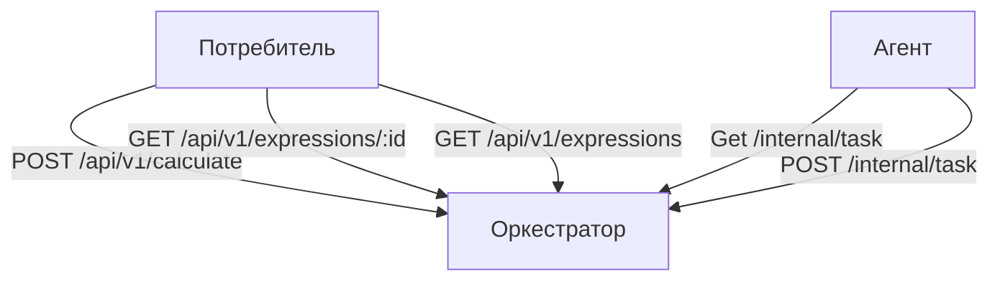

# DistrArithmeticExpresCalc
Проект "Распределенный вычислитель арифметических выражений" в рамках обучение в Яндекс практикум.
Он позволяет рассчитать результат поступившего арифметического выражения в асинхронном режиме.
Через POST запрос передается выражение на вычисление и его id.
Через GET запрос можно получить результат обработки конкретного выражения по id или списка всех выражений.

# Примечание
- Требуется установленная версия go 1.22.0 +.
- Все примеры указаны для cmd Windows 10+.

# Запуск проекта
1) Скачать проект на свой ПК.
2) Открыть консоль, перейти в папку с проектом и запустить оркестратор.(В начале подтянуться используемые сторонние пакеты.)
```
cd [Путь до проекта]/DistrArithmeticExpresCalc/cmd/orchestratorserv
go run main.go
```
3) Открыть вторую консоль, перейти в папку с проектом и запустить агента.
```
cd [Путь до проекта]/DistrArithmeticExpresCalc/cmd/agent
go run main.go
```
4) Открыть третью консоль, через которую добавить выражение на вычисление.(Список примеров можно найти ниже)
```
curl --header "Content-Type: application/json" --request POST --data {\"id\":1,\"expression\":\"21*(7+5)\"} http://localhost:8080/api/v1/calculate
```
5) Получить список результатов через команду
```
curl http://localhost:8080/api/v1/expressions
```

# Описание
## Внутри проект состоит из двух модулей:
- Сервер, который принимает арифметическое выражение, переводит его в набор последовательных задач и обеспечивает порядок их выполнения. Далее будем называть его "оркестратором".
- Вычислитель, который может получить от "оркестратора" задачу, выполнить его и вернуть серверу результат. Далее будем называть его "агентом".



## Оркестратор
Сервер, который имеет следующие endpoint-ы:

### POST запрос на добавление выражения и его id.
Выражение может состоять только из цифр и символов +-*/.()
Структура запроса:
```
curl --header "Content-Type: application/json" --request POST --data {\"id\":<уникальный идентификатор выражения>,\"expression\":<строка с выражением>} http://localhost:8080/api/v1/calculate
```
Структура ответа:
Коды:
    * 201 - выражение принято для вычисления
    * 422 - невалидные данные
    * 500 - что-то пошло не так
#### Пример:
```
curl --header "Content-Type: application/json" --request POST --data {\"id\":1,\"expression\":\"2*3+1\"} http://localhost:8080/api/v1/calculate
```

### GET запрос для получения конкретного выражения. 
Структура запроса:
```
curl http://localhost:8080/api/v1/expressions/:id
```
Структура ответа:
Коды:
    * 200 - успешно получено выражение
    * 404 - нет такого выражения
    * 500 - что-то пошло не так
Тело:
```
{
    "expression":
    {

        "id": <идентификатор выражения>,
        "status": <статус вычисления выражения>,
        "result": <результат выражения>
    }
 }
 
```
#### Пример:
```
curl http://localhost:8080/api/v1/expressions/1
```

### GET запрос для получения списка выражений. 
Структура запроса:
```
curl http://localhost:8080/api/v1/expressions
```
Структура ответа:
Коды:
* 200 - успешно получен список выражений
* 500 - что-то пошло не так
Тело:
```
{
    "expressions": [
        {
            "id": <идентификатор выражения>,
            "status": <статус вычисления выражения>,
            "result": <результат выражения>
        },
        {
            "id": <идентификатор выражения>,
            "status": <статус вычисления выражения>,
            "result": <результат выражения>
        }
    ]
}
```
#### Пример:
```
curl http://localhost:8080/api/v1/expressions
```

### GET запрос для получения задачи для выполения. (Используется агентом)
Структура запроса:
```
curl http://localhost:8080/internal/task
```
Структура ответа:
Коды:
    * 200 - успешно получена задача
    * 404 - нет задачи
    * 500 - что-то пошло не так
Тело:
```
{
    "task":
    {
        "id": <идентификатор задачи>,
        "arg1": <имя первого аргумента>,
        "arg2": <имя второго аргумента>,
        "operation": <операция>,
        "operation_time": <время выполнения операции>
    }
}
```
#### Пример:
```
curl http://localhost:8080/internal/task
```

### POST запрос передачи результата обработки данных задачи. (Используется агентом)
Структура запроса:
```
curl --header "Content-Type: application/json" --request POST --data {\"id\":<идентификатор задачи>,\"result\":<результат вычисления>} http://localhost:8080/internal/task
```
Структура ответа:
Коды:
    * 200 - успешно записан результат
    * 404 - нет такой задачи
    * 422 - невалидные данные
    * 500 - что-то пошло не так
#### Пример:
```
curl --header "Content-Type: application/json" --request POST --data {\"id\":\"fca534fc-20b0-11ef-a32b-d8bbc1b3d68a\",\"result\":6} http://localhost:8080/api/v1/calculate
```

## Агент
Демон, который получает выражение для вычисления с сервера, вычисляет его и отправляет на сервер результат выражения.

При старте демон запускает несколько горутин, каждая из которых выступает в роли независимого вычислителя. Количество горутин регулируется переменной среды
COMPUTING_POWER. Если данная переменная не указана, то берется значение по умолчанию из конфигурации. (./DistrArithmeticExpresCalc/internal/app/agent/config.go)

Агент общается с оркестратором по http.
Агент все время приходит к оркестратору за задачей(в ручку GET internal/task для получения задач).
Частоту обращения можно отрегулировать через параметр конфигурации PollingInterval. (./DistrArithmeticExpresCalc/internal/app/agent/config.go)
Агент производит вычисление и в ручку оркестратора (POST internal/task для приёма результатов обработки данных) отдаёт результат.


# Примеры запросов на успешное добавление выражения c последующем успешным результатом
```
curl --header "Content-Type: application/json" --request POST --data {\"id\":1,\"expression\":\"21*(7+5)\"} http://localhost:8080/api/v1/calculate
curl --header "Content-Type: application/json" --request POST --data {\"id\":3,\"expression\":\"-1+2\"} http://localhost:8080/api/v1/calculate
curl --header "Content-Type: application/json" --request POST --data {\"id\":4,\"expression\":\"32*0.5+16/32-(34+16)-100\"} http://localhost:8080/api/v1/calculate
curl --header "Content-Type: application/json" --request POST --data {\"id\":4,\"expression\":\"(1+(-60+4+15*0.2))*(1+0.5*3)\"} http://localhost:8080/api/v1/calculate
```

# Примеры запросов на добавление выражения, которые приведет к ошибке
## Не корректное выражение
```
curl --header "Content-Type: application/json" --request POST --data {\"id\":1,\"expression\":\"a1+b4\"} http://localhost:8080/api/v1/calculate
```
## Ошибка деления на 0
```
curl --header "Content-Type: application/json" --request POST --data {\"id\":1,\"expression\":\"12/0\"} http://localhost:8080/api/v1/calculate
curl --header "Content-Type: application/json" --request POST --data {\"id\":2,\"expression\":\"12/(5-5)\"} http://localhost:8080/api/v1/calculate
```
## Ошибка при добавлении задач с одинаковым id
Ошибка будет на втором запросе
```
curl --header "Content-Type: application/json" --request POST --data {\"id\":1,\"expression\":\"7+5\"} http://localhost:8080/api/v1/calculate
curl --header "Content-Type: application/json" --request POST --data {\"id\":1,\"expression\":\"6-3\"} http://localhost:8080/api/v1/calculate
```